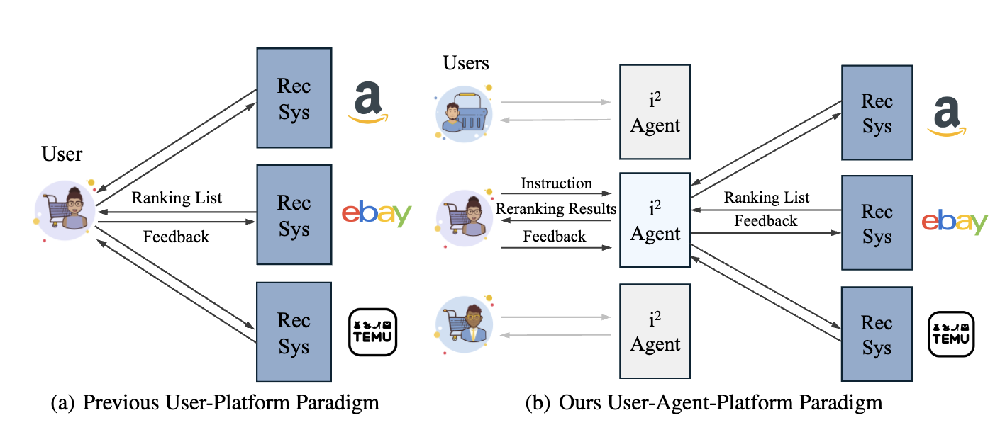

# iAgent

This repository provides the implementation for the paper **"iAgent"**.

The traditional recommendation ecosystem primarily focuses on designing sophisticated models to enhance ranking performance, thereby increasing platform benefits. However, these models often neglect the importance of user-driven instructions and put users under the direct control of recommender systems.

In contrast, **iAgent** introduces an individualized, instruction-aware agent for each user, generating re-ranking results based on user instructions. The memory of the agent is influenced solely by the individual user, providing personalized services without external biases.

<div align=center></div>

## 🔑 Key Features of iAgent

- **New Datasets and Problem**: To establish benchmarks for the new user-agent-platform paradigm, we created four recommendation datasets featuring user-driven instructions, collectively named **InstructRec**. These datasets were constructed from existing resources such as **Amazon**, **Goodreads**, and **Yelp**. We introduce an **Instruction-aware Agent (iAgent)** that learns user interests based on provided free-text instructions while leveraging external knowledge as a domain expert. Unlike constrained instructions in CRS and Webshop, the free-text instructions in InstructRec allow users to express their needs beyond product attributes.

| **Model**  | **Instruction Awareness** | **Instruction Type** | **Dialogue Interaction** | **Dynamic Interest** | **Learning from Feedback** | **External Knowledge** |
|------------|---------------------------|-----------------------|--------------------------|----------------------|---------------------------|------------------------|
| SR         | ❌                         | N/A                   | N/A                      | ❌                    | ❌                         | ❌                      |
| CRS        | ✅                         | Fixed                 | Multiple Turns           | ✅                    | ❌                         | ❌                      |
| RecAgent   | ❌                         | N/A                   | N/A                      | ❌                    | ❌                         | ✅                      |
| Ours       | ✅                         | **Flexible**          | **0, 1, or Multiple Turns**  | ✅                    | ✅                         | ✅                      |

- **🚀 Agent Learning from Individual Feedback**: We introduce the **Individual Instruction-aware Agent (i<sup>2</sup>Agent)**, which incorporates a dynamic memory mechanism featuring a profile generator and dynamic extractor to further explore user interests. The **profile generator** maintains a user-specific profile using historical information and feedback, while the **dynamic extractor** captures evolving profiles based on real-time instructions. Unlike existing recommendation models, **i<sup>2</sup>Agent** is designed specifically for individual users, ensuring that the interests of less-active users are protected and unaffected by other users.

## 📦 Requirements

```bash
conda create --name iagent python=3.9
pip install -r requirements.txt
```


## 🧰 Usage

### 💾 Dataset Preparation

1. Create a data directory:

```bash
mkdir data/
cd data/
```

2. Download [InstructRec Dataset](https://drive.google.com/drive/folders/1-3kHU9D4IH210kSYL-m2cCgWbcY5ilBI?usp=sharing).

```bash
gdown $urls$
```

### 🔑  Use with OpenAI API
You need to get your OpenAI API key from https://platform.openai.com/api-keys.
Then set up your OpenAI API key as an environment variable

```bash
export OPENAI_API_KEY=<YOUR_OPENAI_API_KEY>
```

### ▶️ Run iAgent

- in **InstructRec - Amazon Books Dataset**
```
python main_iagent_mp.py --dataset "amazon" --domain "books" --agent_type "static"
```


- in **InstructRec - Amazon Movietv Dataset**
```
python main_iagent_mp.py --dataset "amazon" --domain "movietv" --agent_type "static"
```

- in **InstructRec - GoodReads Dataset**
```
python main_iagent_mp.py --dataset "good" --domain "reads" --agent_type "static"
```

- in **InstructRec - Yelp Dataset**
```
python main_iagent_mp.py --dataset "yelp" --domain "yelp" --agent_type "static"
```

### ▶️ Run i<sup>2</sup>Agent
- in **InstructRec - Amazon Books Dataset**
```
python main_iagent_mp.py --dataset "amazon" --domain "books" --agent_type "dynamic"
```

- in **InstructRec - Amazon Movietv Dataset**
```
python main_iagent_mp.py --dataset "amazon" --domain "movietv" --agent_type "dynamic"
```

- in **InstructRec - GoodReads Dataset**
```
python main_iagent_mp.py --dataset "good" --domain "reads" --agent_type "dynamic"
```

- in **InstructRec - Yelp Dataset**
```
python main_iagent_mp.py --dataset "yelp" --domain "yelp" --agent_type "dynamic"
```
